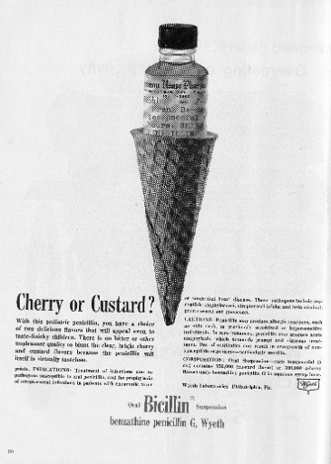
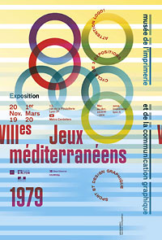
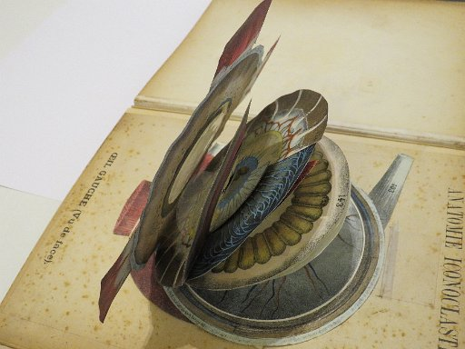
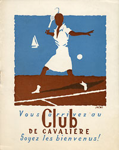

<!DOCTYPE html>
<html>
	<html lang="fr">

<head>
	<meta charset="UTF-8">
 	<title>Musée de l'imprimerie</title>
 	<link rel="stylesheet" type="text/css" href="slick-1.8.1/slick/slick.css"/>
  <link rel="stylesheet" type="text/css" href="slick-1.8.1/slick/slick-theme.css"/>	
 	<link href="https://fonts.googleapis.com/css?family=Karla&display=swap" rel="stylesheet">
  	<link rel="stylesheet" href="https://stackpath.bootstrapcdn.com/bootstrap/4.3.1/css/bootstrap.min.css" integrity="sha384-ggOyR0iXCbMQv3Xipma34MD+dH/1fQ784/j6cY/iJTQUOhcWr7x9JvoRxT2MZw1T" crossorigin="anonymous">
  	<link rel="stylesheet" href="https://stackpath.bootstrapcdn.com/bootstrap/4.3.1/css/bootstrap.min.css" integrity="sha384-ggOyR0iXCbMQv3Xipma34MD+dH/1fQ784/j6cY/iJTQUOhcWr7x9JvoRxT2MZw1T" crossorigin="anonymous">
  	<link rel="stylesheet" href="./style.css">
  	
  
	<title>Musée de l'Impression et de la Communication Graphique</title>
</head>

<body>
<!-- Header par Leo -->
	

			

				
			<nav>
				<ul class="naviguation">
					<li>Le Musée</li>
					<li>Expositions</li>
					<li>Activités/Public</li>
					<li>Documentation</li>
					<li>Presse</li>
					<li>Amis du Musée</li>
					<li>Librairie/Boutique</li>
				</ul>
			</nav>
			

				

				

				

				<h1 class="toptxt">Le Musée</h1>
				
Après 50 ans d’existence, le Musée de l’imprimerie, Lyon, est devenu le Musée de l’imprimerie et de la communication graphique. Un changement de nom qui s’accompagne d’une muséographie et d’une scénographie rénovées, d’une nouvelle identité visuelle.

				<button class="toptxt">Découvrir</button>
			<!-- 
 -->
		

<!--////1ere DIV les expositions à venir fond gris////-->

        <!--Titre-->

        

            <h3>Les Expositions</h3>
        

        <!--image caligraphique + bloc jaunne + texte-->

        

            <!--Bloc jaune et texte décallé-->
            
            

                

                    <h4>Actuellement en expo</h4> 
                

            

        

        

        

            <!--Texte sous l'image-->

            

  
                
La calligraphie latine à l'honneur cet automne au musée!

                
Plusieurs dates en compagnie de Roger Gorrindo, artiste calligraphe reconnu, également graveur lapidaire, afin de découvrir ou même de s’essayer au geste et au tracé de « la belle écriture ».

         
            

            <!--Bouton sous l'image-->

            

                <button class="bouton11">Voir les nouveautés</button>
            

        

    

<!-- /////////////////////////////////////////////////////// -->

		

			<h3>Une collection élargie</h3>
			
Le musée a fêté son cinquantenaire en 2014 avec une nouvelle présentation de sa collection permanente et une nouvelle appellation, Musée de l’imprimerie et de la communication graphique, qui évoque son implication dans le monde d’aujourd’hui. En 50 ans, les industries graphiques ont connu des évolutions  foudroyantes, passant des techniques traditionnelles au numérique. Les collections du musée ont suivi cette évolution et se sont considérablement élargies.

			<button id="buttonFlux1" class="buttonFlux">Expos permanentes</button>
		

		
            
			

				

					   <h4>Expos Permanentes</h4>    
				

			   

		

	

	
	

		

			<h3 >Le logo des Jeux Méditerranéens 3e édition</h3>
			
Voici le mariage réussi du sport et du graphisme avec l’évocation de ces Jeux, moins connus que leurs grands frères les JO. Les JM existent depuis plus de 70 ans (1951) et rassemblent 26 nations du bassin méditerranéen et trois continents : l’Europe, L’Afrique et l’Asie.

			<button id="buttonFlux2" class="buttonFlux">Voir la programmation</button>
		

		
            
			

				

					   <h4 >Prochainement</h4>    
				

			   

		

	

	
	
	
	

		

			<h3>Un moment fort du design européen</h3>
			
L’exposition Art pour tous est constituée de quatre-vingt cinq affiches, en provenance des prestigieuses collections du Yale Center for British Art. Commanditées entre 1908 et 1960 aux plus grands graphistes et artistes de l’époque par London sur de l’art universel.

			<button id="buttonFlux3" class="buttonFlux">Voir les archives</button>
		

		

			

				

					<h4>Précédemment</h4>
				

			

		

	

<h3>Les expositions populaires</h3>
	

    

    	
    	

   

    	 
→Voir les antibiotiques 1945-2004 :

    	Pourquoi une exposition sur les publicités dédiées aux antibiotiques au musée de l’Imprimerie et de la Communication graphique ?  	
<a href='articles.html'>Lire plus</a>

   
    

    	

    	

    	 

→Le logo des Jeux Méditerranéens 3e édition de la série Attention logo ! 

Voici le mariage réussi du sport et du graphisme avec l’évocation de ces Jeux, moins connus que leurs grands frères les JO. 
    	
<a href='articles.html'>Lire plus</a>

    

 

 

→L’aventure intérieure :

Nous exposons dans le cadre de notre Petit Salon annuel, 22 ouvrages « à système », ou livres animés, sur le thème de l’anatomie humaine, animale, végétale. 
<a href='articles.html'>Lire plus</a>

   
    

 

→Marcel Jacno, ephemera, paquet de Gauloises et Festival d’Avignon : 

À l’occasion des trente ans de la disparition du graphiste français Marcel Jacno (1904- 1989), Eric Pascalis, détenteur d’une partie des archives de cet immense graphiste, nous a confié une quarantaines de documents évoquant l’activité multiforme de Jacno : maquettes, brochures, logotypes, invitations, affiches…
<a href='articles.html'>Lire plus</a>

  
  
  
  
<!-- /////////////////////////////////////////////////////// -->

		<!--Barre jaune par Antoine-->
	

		

			

				<h2>Horaires d'ouverture</h2>
				

					
<b>Mardi:</b> 09h30 - 17h00

					
<b>mercredi</b> au <b>dimanche:</b> 10h00 - 17h45

				

				

					

					

					<h5 class="description">Cliquer pour plus d'informations</h5>
				

				

					
13, rue de la Poulaillerie

					
69002 Lyon (métro Cordeliers

				

			

			

			

				<h2>Tarifications</h2>
				

					<!-- Barre jaune + --> 
<b>Plein tarif</b> : <b>6€</b> - <b>8€</b> (en période d'exposition)

					
<b>Tarif réduit</b> : <b>4€</b> - <b>6€</b> (en période d'exposition)

				

				

					<h5>Concerne les 18-25 ans et les employés de l’Office de Tourisme de Lyon ainsi que les titulaires du pass annuel Musée des Confluences</h5>
				

				

					<button class="boutonbilleterieht">Billeterie</button>
				

				
			

		

	

<!--Footer par Mael/Antoine-->
	

		

			

				</img>
			

			

				
Crédits et informations légales

			

		

	
	
		

			
<h4 class="Tfooter">Nos affiliations  </h4>

			

Association of European Museums

			

Bibliothèque municipale de Lyon

			

Institut de l'histoire du livre

		

	
	
		

			
<h4 class="Tfooter">Divers  </h4>

			

Nos partenaires

			

Nos sources

			

Apparitions

		

	
		

			

				
<h4 class="Tfooter">S'abonner à la newsletter</h4>

				

					<FORM>
						<TEXTAREA class="newsletter" name="newsletter" rows=1 cols=30 placeholder="Adresse Email"></TEXTAREA>
					</FORM>
				

			

			

				

					</img>
					</img>
					</img>
					</img>
				

			

		

	

</body>
</html>
